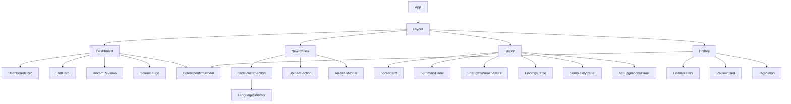

<div align="center">

# ⚛️ LUMUS — Frontend

### *React 19 + Vite + TailwindCSS client application*


> Part of the [LUMUS monorepo](../README.md). See the root README for full project overview, architecture diagrams, and API reference.

</div>

---

## 📋 Table of Contents

- [Overview](#-overview)
- [Tech Stack](#️-tech-stack)
- [Getting Started](#-getting-started)
- [Project Structure](#-project-structure)
- [Pages & Routes](#-pages--routes)
- [Component Architecture](#-component-architecture)
- [State Management](#-state-management)
- [Theming System](#-theming-system)
- [Environment Variables](#-environment-variables)
- [Available Scripts](#-available-scripts)

---

## 🔍 Overview

The LUMUS frontend is a **React 19 + Vite 8** SPA deployed on Vercel at [`ai-review-frontend-lovat.vercel.app`](https://ai-review-frontend-lovat.vercel.app). It communicates with the Express backend via Axios with credential support (httpOnly cookies for JWT auth).

Key architectural decisions:
- **Redux Toolkit** for global auth and dashboard state, persisted across navigations
- **React Context** (`ThemeContext`) for lightweight light/dark theme without Redux overhead
- **React Router v7** for client-side routing with protected route wrappers
- **Axios instance** in `src/https/axios.js` with a `baseURL` from `VITE_API_URL` and a 401 interceptor that redirects unauthenticated users to `/login`
- **Monaco Editor** (`@monaco-editor/react`) for an IDE-quality code paste panel synced to the selected language

---

## 🛠️ Tech Stack

| Category | Package | Version |
|---|---|---|
| **Framework** | `react` + `react-dom` | ^19.2.7 |
| **Build Tool** | `vite` + `@vitejs/plugin-react` | ^8.1.1 |
| **Routing** | `react-router-dom` | ^7.18.1 |
| **State** | `@reduxjs/toolkit` + `react-redux` | ^2.12.0 |
| **Styling** | `tailwindcss` (v4) + `@tailwindcss/vite` | ^4.3.2 |
| **Animations** | `framer-motion` | ^12.42.2 |
| **Icons** | `lucide-react` | ^1.23.0 |
| **Code Editor** | `@monaco-editor/react` | ^4.7.0 |
| **Charts** | `recharts` | ^3.9.2 |
| **File Upload** | `react-dropzone` | ^15.0.0 |
| **HTTP Client** | `axios` | ^1.18.1 |
| **Notifications** | `react-toastify` | ^11.1.0 |
| **Font** | `@fontsource/inter` | ^5.2.8 |
| **Linting** | `eslint` v10 + react-hooks + react-refresh plugins | — |

---

## 🚀 Getting Started

### Prerequisites

- Node.js >= **18.0.0**
- npm >= **9.0.0**
- Backend server running at the URL set in `VITE_API_URL`

### Installation

```bash
cd frontend
npm install
```

### Environment Variables

Create `frontend/.env`:

```env
VITE_API_URL=http://localhost:3000
```

For production, set `VITE_API_URL` to your Railway backend URL in the Vercel dashboard.

### Start Dev Server

```bash
npm run dev
```

App runs at **http://localhost:5173** with Vite HMR.

---

## 📁 Project Structure

```
frontend/src/
│
├── 📂 components/
│   ├── 📂 Auth/
│   │   ├── AuthBrand.jsx          # Logo + brand header (size="small"|"large")
│   │   └── AuthInput.jsx          # Icon + label input field
│   │
│   ├── 📂 Dashboard/
│   │   ├── DashboardHero.jsx      # Welcome banner + quick action pill buttons
│   │   ├── StatCard.jsx           # Stat widget with sparkline LineChart
│   │   ├── RecentReviews.jsx      # Scrollable recent reviews list with delete
│   │   └── ScoreGauge.jsx         # Donut chart average score + sparkline
│   │
│   ├── 📂 History/
│   │   ├── HistoryFilters.jsx     # Search input + status/language/type dropdowns
│   │   ├── ReviewCard.jsx         # Individual review row card with status badge
│   │   └── Pagination.jsx         # Page prev/next controls
│   │
│   ├── 📂 NewReview/
│   │   ├── AnalysisModal.jsx      # Full-screen overlay tracking pipeline stages
│   │   ├── CodePasteSection.jsx   # Monaco editor panel + language selector bar
│   │   ├── LanguageSelector.jsx   # Dropdown for language selection (receives supportedLanguages prop)
│   │   └── UploadSection.jsx      # react-dropzone drag-and-drop file upload panel
│   │
│   ├── 📂 Report/
│   │   ├── ScoreCard.jsx          # Donut chart score + grade badge (A/B/C/D/F)
│   │   ├── SummaryPanel.jsx       # AI executive summary card
│   │   ├── StrengthsWeaknesses.jsx # Two-column strengths / weaknesses list
│   │   ├── FindingsTable.jsx      # Filterable findings table with severity badges
│   │   ├── StaticAnalysisPanel.jsx # Static analysis tab content
│   │   ├── ComplexityPanel.jsx    # Complexity metrics + dependency graph
│   │   └── AISuggestionsPanel.jsx  # Full AI narrative review tab
│   │
│   ├── 📂 common/
│   │   └── DeleteConfirmModal.jsx  # Confirmation dialog with loading state
│   │
│   └── Layout.jsx                  # Persistent sidebar + header shell
│
├── 📂 pages/
│   ├── Login.jsx                   # /login
│   ├── Register.jsx                # /register
│   ├── Dashboard.jsx               # / (protected)
│   ├── NewReview.jsx               # /new-review (protected)
│   ├── Report.jsx                  # /report/:id (protected)
│   └── History.jsx                 # /history (protected)
│
├── 📂 redux/
│   ├── store.js                    # configureStore (authSlice + dashboardSlice)
│   └── 📂 slices/
│       ├── authSlice.js            # login, register, logout, checkAuth thunks
│       └── dashboardSlice.js       # fetchDashboardData thunk → stats + recentReviews
│
├── 📂 context/
│   └── ThemeContext.jsx            # ThemeProvider + useTheme hook
│
├── 📂 https/
│   └── axios.js                    # Axios instance (baseURL=VITE_API_URL, withCredentials=true)
│
├── 📂 hooks/                       # Custom hooks (reserved)
│
├── App.jsx                         # BrowserRouter + route definitions + ProtectedRoute wrapper
├── main.jsx                        # ReactDOM.createRoot → <Provider store><ThemeProvider><App/>
└── index.css                       # @import tailwindcss + global keyframes
```

---

## 📄 Pages & Routes

| Path | Component | Auth Required | Description |
|---|---|---|---|
| `/login` | `Login.jsx` | ❌ | Email + password login form |
| `/register` | `Register.jsx` | ❌ | New account creation |
| `/` | `Dashboard.jsx` | ✅ | Stats cards, score donut, recent reviews list |
| `/new-review` | `NewReview.jsx` | ✅ | Code paste (Monaco) or file upload + submit |
| `/report/:id` | `Report.jsx` | ✅ | 4-tab report: Overview / Static / Complexity / AI Review |
| `/history` | `History.jsx` | ✅ | Paginated + filtered review history |

Unauthenticated users visiting protected routes are redirected to `/login` by the `ProtectedRoute` component in `App.jsx`.

---

## 🧩 Component Architecture



---

## 🗃️ State Management

| State | Manager | Slice / Provider |
|---|---|---|
| Authenticated user (id, name, email) | Redux | `authSlice` |
| Auth loading / error | Redux | `authSlice` |
| Dashboard stats + recent reviews | Redux | `dashboardSlice` |
| Light / Dark theme | React Context | `ThemeContext` |
| Local UI (modals, tabs, filters, pagination) | `useState` | Per-component |

The Redux store is configured in `src/redux/store.js` and provided at the top of the tree in `main.jsx`:

```jsx
<Provider store={store}>
  <ThemeProvider>
    <App />
  </ThemeProvider>
</Provider>
```

---

## 🎨 Theming System

LUMUS uses **TailwindCSS v4** with `darkMode: 'class'` (toggled on `<html>`). The `ThemeProvider` in `ThemeContext.jsx` initialises theme from:

1. `localStorage` key `lumus-theme` (if previously set)
2. `window.matchMedia('(prefers-color-scheme: dark)')` (on first visit)

**Custom design tokens** (`tailwind.config.js`):

```js
theme: {
  extend: {
    colors: {
      'sakura-pink':   '#F472B6',  // Primary accent — pink-400
      'sakura-strong': '#EC4899',  // Stronger accent — pink-500
      'sakura-blush':  '#FBCFE8',  // Soft blush — pink-200
    }
  }
}
```

All components use `dark:` utility variants. No theme-switching JS is needed beyond toggling the `dark` class.

---

## 🔐 Environment Variables

| Variable | Description | Example |
|---|---|---|
| `VITE_API_URL` | Base URL for all API requests | `http://localhost:3000` or `https://your-app.railway.app` |

All Axios requests use `withCredentials: true` so the `token` cookie is sent cross-origin automatically.

---

## 📜 Available Scripts

```bash
npm run dev       # Start Vite dev server with HMR (port 5173)
npm run build     # Production build → /dist
npm run preview   # Preview the /dist build locally
npm run lint      # Run ESLint across all .js/.jsx files
```
